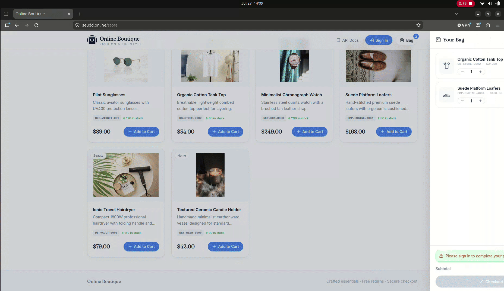
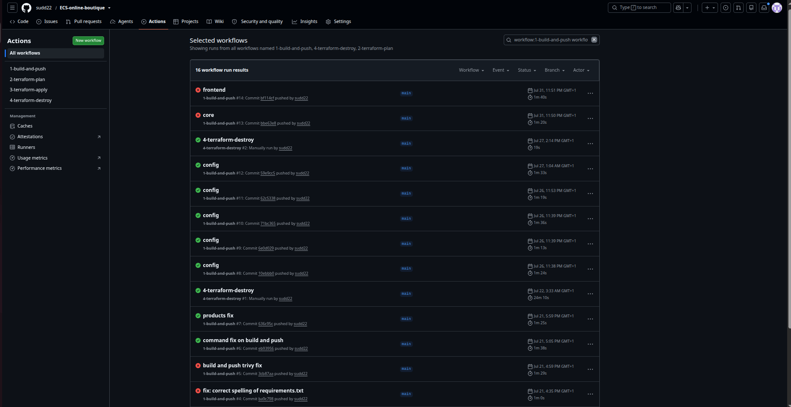

<h1 align="center">ECS Online Boutique — AWS Platform &amp; AIOps</h1>

<p align="center">
  <strong>A FastAPI storefront on ECS Fargate with Terraform, CI/CD and approval-based incident recovery.</strong><br/>
  GitHub Actions delivers the container; AWS FIS, DevOps Agent and Slack demonstrate investigation and recovery.
</p>

<p align="center">
  Browse the catalogue, sign in, create an order and run the payment and notification flows through one application.
</p>

---

## AWS architecture

<p align="center">
  
</p>


## AIOps architecture

<p align="center">
  
</p>

The application runs in **`eu-west-2` (London)**. The FastAPI service runs on ECS Fargate in private subnets. An Application Load Balancer and AWS WAF handle public traffic, while RDS PostgreSQL stores the application data. Successful simulated payments publish to SQS; a Lambda consumer records notifications, with repeated failures moved to a dead-letter queue. ADOT exports telemetry, and GitHub Actions publishes the application image to ECR using OIDC credentials.

AWS FIS blocks outbound database traffic on TCP `5432` for one ECS task. Database-backed requests return HTTP `500`, triggering the ALB target 5xx alarm. EventBridge invokes an ingestion Lambda that sends incident context to AWS DevOps Agent. SNS carries alarm and recovery notifications to Slack through AWS Chatbot. After an operator approves remediation, a scoped Lambda forces an ECS rollout to replace affected tasks.

[Recovery walkthrough and screenshots](#observability-and-aiops) · [CI/CD](#cicd--four-workflows-with-oidc) · [Run locally](#run-locally-no-aws-required)

## Storefront demo

[](https://github.com/sudd22/ECS-online-boutique/raw/refs/heads/main/Assets/webapp.webm)

**[Watch the full storefront recording](https://github.com/sudd22/ECS-online-boutique/raw/refs/heads/main/Assets/webapp.webm)** · [Recording file](Assets/webapp.webm)

The preview is an excerpt from the original WebM. The storefront at `/store` serves the catalogue, shopping bag, sign-in and checkout from the same container as the API.

## Application design

The application is one deployable service with five internal modules:

| Module | Responsibility | Main API |
|--------|----------------|----------|
| Auth | Users, tenants and JWT login | `/auth` |
| Product | Catalogue lookup and stock operations | `/products` |
| Order | Tenant-scoped orders, stock checks and totals | `/orders` |
| Payment | Simulated gateway responses and payment event publishing | `/payments` |
| Notification | Notification records and SQS consumption | `/notifications` |

Each module owns its tables logically. Modules do not join directly to another module's tables. They use public service functions for synchronous work and SQS for asynchronous events.

---

## Why this project

This project applies cloud and platform engineering practices to a small e-commerce application:

- FastAPI and SQLAlchemy provide the application and data layer
- Domain modules keep the monolith organised without the cost of separate services
- ECS Fargate runs the container without server management
- RDS PostgreSQL stores the catalogue, users, orders, payments and notifications
- SQS and a dead-letter queue handle background notification work
- Terraform defines the AWS infrastructure
- GitHub Actions uses OIDC instead of long-lived AWS access keys
- AWS FIS, CloudWatch, DevOps Agent and Slack demonstrate approval-based remediation

The application also includes a small storefront at `/store`, served by FastAPI from the same container as the API.

---

## How a checkout works

1. Open `/store`. The page loads the catalogue from `GET /products`.
2. Add products to the client-side bag.
3. Sign in through the storefront or `POST /auth/login`.
4. Submit the bag to `POST /orders` with the bearer token.
5. The order module asks the product module for the selected products, checks stock, calculates the total and creates the order.
6. Call `POST /payments/process` to run the payment simulator.
7. A successful payment is saved and publishes a `payment.completed` event to SQS when a queue is configured.
8. The notification consumer reads the event and records the notification.

Notifications are persisted as records rather than sent as customer emails. The payment route records success and publishes the event, but does not call the order module's `mark_order_paid` function.

The payment service is deliberately simulated:

- Most amounts return a successful payment after a short delay.
- An amount of **`66.60`** returns HTTP `402` to provide a repeatable failure path.
- An event with `order_id` **`999`** fails in the notification consumer so SQS retries it and eventually sends it to the dead-letter queue.

---

## Infrastructure highlights

### Network and edge

- VPC with two public and two private subnets across two Availability Zones
- ECS tasks, RDS and the notification Lambda run in private subnets
- Public Application Load Balancer forwards traffic to port `8000`
- AWS WAF rate-limits requests to 100 per IP
- One shared NAT Gateway is optional and controlled with `deploy_nat_gateway`
- Production adds Route 53 records and an ACM certificate for `seudd.online`

### Application platform

- ECS Fargate service named `dev-b2b-monolith-service` in development
- Production runs with two desired tasks; development uses one
- RDS PostgreSQL stores application data
- RDS manages the database master password in Secrets Manager
- SQS notifications queue uses a dead-letter queue after three failed receives
- The notification consumer is a container-image Lambda using the same ECR image as the application

### Container and delivery

- Python 3.11 slim multi-stage image
- Dependencies are built as wheels before the runtime image is assembled
- The container runs as a non-root user
- Docker health checks call `/health`
- ECR stores the application image and scans images on push
- The same image supports ECS with Uvicorn and Lambda with `awslambdaric`
- The ECS task also includes an SSM agent sidecar for the fault-injection setup

---

## Scalability and resilience

The design keeps the application simple while allowing the main components to scale independently:

- Fargate can run more than one application task.
- The ALB distributes requests between healthy tasks.
- RDS provides the shared relational data store.
- SQS separates notification processing from the checkout request.
- Lambda consumes notifications without a permanently running worker.
- The notification dead-letter queue keeps failed messages for investigation.

The current implementation is sized as a portfolio and demonstration system rather than a high-volume retail platform. The production environment uses two Fargate tasks, while development is smaller and can be scaled down between sessions. The RDS module defaults to a single-AZ instance unless its settings are changed.

---

## CI/CD — four workflows with OIDC

GitHub Actions authenticates to AWS through GitHub's OIDC provider. No long-lived AWS access keys are required in the repository.

| Workflow | Trigger | What it does |
|----------|---------|--------------|
| `build-and-push.yml` | Push to `main` or manual run | Builds the image, runs Trivy, pushes SHA and `latest` tags to ECR, then forces an ECS deployment |
| `terraform-plan.yml` | Pull requests changing Terraform or manual run | Runs Terraform formatting, validation, TFLint, Checkov and a plan |
| `terraform-apply.yml` | Terraform changes on `main` or manual run | Applies the selected environment with Terraform |
| `terraform-destroy.yml` | Manual run | Destroys the selected Terraform environment |

The production safeguards require:

- `apply-prod` when manually applying the production environment
- `destroy-prod` when manually destroying the production environment

Trivy uses `exit-code: 0` and Checkov uses `soft_fail: true`, so scan findings do not block deployment. Automatic runs target development; manual runs can select production. The build workflow only runs for its configured path filter, which currently includes `requirment.txt` rather than `dockerfiles/requirements.txt` and omits Dockerfile changes. Use a manual build for those changes unless the filter is updated.

### Pipeline evidence

<p align="center">
  
</p>

---

## Security model

| Protection | How it works |
|------------|--------------|
| Private application tasks | ECS tasks do not receive public IP addresses and accept application traffic from the ALB |
| Private database | RDS accepts PostgreSQL traffic from the ECS and notification Lambda security groups |
| Edge rate limiting | AWS WAF blocks an IP after the configured request limit |
| Temporary CI credentials | GitHub Actions assumes AWS roles through OIDC |
| Secret storage | RDS manages the master password in Secrets Manager |
| Non-root container | The application image runs as UID `10001` |
| Scoped remediation | The remediation Lambda is limited to updating the configured ECS service |

This is a demonstration application. Payment processing is simulated, JWTs use application configuration, and the authentication, payment and notification routes should be reviewed before using the project for real customer data or payments.

Do not commit `.env` files, Terraform state, access keys, database passwords, webhook URLs or API keys. Use environment variables, GitHub secrets and Secrets Manager for local and deployed credentials.

---

## Observability and AIOps

The ECS task includes an AWS Distro for OpenTelemetry (ADOT) sidecar. The FastAPI application is started with OpenTelemetry auto-instrumentation and sends telemetry to the sidecar. CloudWatch receives logs and metrics, while X-Ray receives traces.

The task and infrastructure also provide:

- `/health` for container and ALB health checks
- Seven-day CloudWatch log retention
- CloudWatch alarms for the development ALB 5xx path
- EventBridge forwarding for alarm events
- DevOps Agent ingestion through a webhook
- Slack approval through AWS Chatbot
- A remediation Lambda that forces a new ECS deployment

The intended demonstration is:

`FIS → CloudWatch alarm → EventBridge → DevOps Agent → Slack approval → remediation Lambda → ECS deployment`

AWS FIS blackholes outbound TCP port `5432` on one ECS task for ten minutes. The database connection fails, but the telemetry path on port `443` remains available. After approval in Slack, the remediation Lambda forces a new deployment and ECS starts a replacement task with a new network interface.

### Recovery walkthrough

1. Start the FIS experiment against one task in the development ECS service.
2. Send database-backed requests, such as `GET /products`, to produce target 5xx errors. The alarm triggers at one or more errors in a 60-second period.
3. EventBridge forwards the `ALARM` event to the ingestion Lambda; DevOps Agent receives the incident context through its configured webhook.
4. Review the investigation and approve remediation from Slack. The remediation handler accepts `IncidentType: NETWORK_BLACKHOLE`.
5. The Lambda calls `ecs.update_service(forceNewDeployment=True)` to replace tasks.
6. Repeat `/products` requests and check the target 5xx metric and alarm recovery.

`/health` returns a static response and does not test database connectivity. Use `/products` alongside `/health` when verifying recovery. The ingestion handler supports resolved incidents, but the current EventBridge rule forwards only `ALARM`; recovery notifications follow the SNS path.

### AIOps Documentation

<p align="center">
  
</p>

<p align="center">
  
</p>

<p align="center">
  
</p>

<p align="center">
  
</p>

Further screenshots: [FIS experiment start](Assets/experiment%20init.png) and [successful ECS redeployment](Assets/Screenshot%20from%202026-07-27%2002-09-40.png).

The AIOps path requires account-specific DevOps Agent webhook settings and Slack workspace and channel identifiers.

---

## Run locally (no AWS required)

### Native Python setup

Requirements: Python 3.11 and pip.

```bash
git clone https://github.com/sudd22/ECS-online-boutique.git
cd ECS-online-boutique

python3.11 -m venv .venv
source .venv/bin/activate
pip install -r dockerfiles/requirements.txt

export ENVIRONMENT=local
export DATABASE_URL=sqlite:///./local_b2b.db
export OTEL_SDK_DISABLED=true
export AWS_ACCESS_KEY_ID=mock_key
export AWS_SECRET_ACCESS_KEY=mock_secret
export AWS_DEFAULT_REGION=eu-west-2
uvicorn app.main:app --reload --port 8000
```

On Windows PowerShell, activate with `.\.venv\Scripts\Activate.ps1` and set the environment using:

```powershell
$env:ENVIRONMENT = "local"
$env:DATABASE_URL = "sqlite:///./local_b2b.db"
$env:OTEL_SDK_DISABLED = "true"
$env:AWS_ACCESS_KEY_ID = "mock_key"
$env:AWS_SECRET_ACCESS_KEY = "mock_secret"
$env:AWS_DEFAULT_REGION = "eu-west-2"
uvicorn app.main:app --reload --port 8000
```

Mock credentials allow the payment module to initialize its SQS client locally. Leave `NOTIFICATIONS_QUEUE_URL` unset to skip publishing; this mode needs no AWS resources.

Open:

- Storefront: [http://localhost:8000/store](http://localhost:8000/store)
- API documentation: [http://localhost:8000/docs](http://localhost:8000/docs)
- Health check: [http://localhost:8000/health](http://localhost:8000/health)
- Product catalogue: [http://localhost:8000/products](http://localhost:8000/products)

Local startup creates the database tables and syncs the sample catalogue. The seeded development account is:

```text
Email: customer@shop.com
Password: password123
```

### Docker Compose

Before running Compose, set `services.web.build.dockerfile` to `dockerfiles/Dockerfile`, relative to its build context:

```yaml
build:
  context: ..
  dockerfile: dockerfiles/Dockerfile
```

Then run from the repository root:

```bash
docker compose -f dockerfiles/compose.yml up --build
```

The Compose database uses PostgreSQL 15 and persists data in the `postgres_local_data` volume. OpenTelemetry is disabled locally because the ADOT sidecar is only used in ECS.

### API 

Get a token with the OAuth2 password flow:

```bash
curl -X POST http://localhost:8000/auth/token \
  -H "Content-Type: application/x-www-form-urlencoded" \
  -d "username=customer@shop.com&password=password123"
```

List products:

```bash
curl http://localhost:8000/products
```

Create an order with the returned token:

```bash
curl -X POST http://localhost:8000/orders \
  -H "Authorization: Bearer <TOKEN>" \
  -H "Content-Type: application/json" \
  -d '{"items":[{"product_id":1,"quantity":1}]}'
```

Run the payment simulator:

```bash
curl -X POST http://localhost:8000/payments/process \
  -H "Content-Type: application/json" \
  -d '{"order_id":1,"amount":"89.00"}'
```

Use `"amount":"66.60"` to exercise the simulated HTTP `402` response.

---

## Repository layout

```text
├── .github/workflows/          # Build, Terraform plan/apply and destroy workflows
├── app/                        # FastAPI modular monolith
│   ├── core/                   # Database, dependencies and seed data
│   ├── modules/
│   │   ├── auth/               # Users, tenants and JWT login
│   │   ├── product/            # Public product catalogue
│   │   ├── order/              # Orders and order items
│   │   ├── payment/            # Payment simulator and SQS publisher
│   │   └── notification/       # Notification records and SQS consumer
│   ├── static/                 # Storefront served at /store
│   ├── config.py               # Environment-based settings
│   └── main.py                 # Application entrypoint and routes
├── Assets/                     # Architecture diagrams, screenshots and demo recording
├── dockerfiles/
│   ├── Dockerfile              # Multi-stage application image
│   ├── compose.yml             # Local PostgreSQL and web services
│   └── requirements.txt        # Python dependencies
├── terraform/
│   ├── persistent/             # State, ECR, KMS and GitHub OIDC resources
│   ├── modules/                # Reusable AWS infrastructure modules
│   └── environments/
│       ├── dev/                # Development environment
│       └── prod/               # Production environment
├── .env.example
├── .gitignore
└── .trivyignore
```

---

## FinOps — controlling build and environment costs

The development platform is designed to run for build verification, demonstrations and fault-injection sessions, then scale down between sessions. The main cost control is the Terraform **NAT Gateway and Elastic IP toggle**, combined with stopping idle compute and removing environments that are no longer needed. Savings depend on runtime, traffic and the resources that remain provisioned.

`deploy_nat_gateway` controls three resources in [`terraform/modules/vpc/main.tf`](terraform/modules/vpc/main.tf):

| Resource | `true` — active session | `false` — idle environment |
|----------|-------------------------|----------------------------|
| `aws_nat_gateway.nat` | Creates one NAT Gateway in the first public subnet | Deletes the NAT Gateway |
| `aws_eip.nat` | Allocates its Elastic IP | Releases the Elastic IP |
| `aws_route.private_nat` | Routes private-subnet internet traffic through NAT | Removes the NAT default route |

All three use `count = var.deploy_nat_gateway ? 1 : 0`. This means the idle configuration releases the address as well as deleting the gateway; it does not leave an unused NAT Elastic IP allocated. The development variable defaults to `false`; an environment's `terraform.tfvars` or command-line value can override it  `terraform/environments/dev/terraform.tfvars

### Other cost controls in this build

| Area | Existing design / control | Saving and remaining costs |
|------|---------------------------|----------------------------|
| ECS Fargate | One development task versus two production tasks; scale development to zero when idle | Avoids idle task compute charges; ALB, database and other provisioned resources remain |
| Network | One shared optional NAT Gateway | Reduces gateway count; traffic from the other Availability Zone can incur cross-AZ transfer costs and shares the gateway's availability dependency |
| RDS | `db.t4g.micro`, 20 GB and single-AZ module defaults; stop development RDS between sessions | Reduces the development footprint; stopped RDS still incurs storage/backup charges and automatically restarts after seven days |
| Notifications | SQS invokes Lambda instead of maintaining a dedicated worker service | Avoids an always-running worker; request, execution and storage charges still depend on usage |
| Logs | ECS application and ADOT log groups retain seven days | Limits retained log volume; ingestion and other log groups still need monitoring |
| Delivery | One modular monolith image and a multi-stage Docker build | Reuses application code for ECS and the notification Lambda; no separate always-running service for each domain |
| CI runs | Path-filtered workflows and manual environment selection | Limits unrelated workflow runs; hosted-runner usage still depends on the GitHub plan and runtime |
| Persistent state | DynamoDB lock table uses `PAY_PER_REQUEST` | Lock-table usage is demand-based; S3 versions, ECR images and KMS remain billable |

RDS stop behavior is documented in [AWS RDS temporary stopping](https://docs.aws.amazon.com/AmazonRDS/latest/UserGuide/USER_StopInstance.html) and [RDS pricing](https://aws.amazon.com/rds/pricing/). The shared NAT trade-off is described in [AWS NAT Gateway basics](https://docs.aws.amazon.com/vpc/latest/userguide/nat-gateway-basics.html).


---

## Teardown

For a short break between development sessions:

```bash
aws ecs update-service \
  --cluster dev-b2b-cluster \
  --service dev-b2b-monolith-service \
  --desired-count 0
```

Then set `deploy_nat_gateway = false` in the development variables and apply Terraform. Stop the development RDS instance from the AWS console.

Disabling NAT removes private-subnet internet egress; the current Terraform does not provide replacement VPC endpoints. The ECS service ignores Terraform changes to `desired_count`, so explicitly restore its task count when resuming.

For a full environment teardown, run `terraform-destroy.yml` from GitHub Actions. The workflow requires `destroy-prod` for production.

The RDS module uses `skip_final_snapshot = true`; take a backup first if its data must be retained.

Keep the persistent Terraform resources unless you intend to recreate the state, lock table, ECR repository and OIDC roles.

---

## Live verification

Check the service health endpoint through the ALB or production domain:

```bash
curl -s https://seudd.online/health
```

Expected response:

```json
{"status":"healthy"}
```

| Check | Expected result |
|-------|-----------------|
| `/health` | Returns `{"status":"healthy"}` |
| `/store` | Storefront loads |
| `/products` | Seeded product catalogue is returned |
| Login | JWT is returned for the seeded account |
| Order creation | An authenticated request creates an order |
| Payment | The simulator returns success or the deliberate `66.60` failure |
| Notification flow | Successful payments publish to SQS when configured |

There is currently no application test suite. The repository's automated validation focuses on Terraform formatting and validation, TFLint, Checkov, container scanning and deployment workflows.

---


## Design decisions

| Choice | Reason |
|--------|--------|
| Modular monolith | Keeps the five business areas separate without the cost of five deployed services |
| Same-origin storefront | Serves the UI and API from one container without CORS configuration |
| SQS and DLQ | Keeps notification work out of the checkout request and preserves failed messages |
| Container-image Lambda | Reuses the application image and notification code |
| OIDC for GitHub Actions | Removes long-lived AWS credentials from CI/CD |
| ADOT sidecar | Sends application telemetry to AWS without adding tracing code to each route |
| Optional NAT Gateway | Allows the development environment to be made cheaper when idle |
| Approval before remediation | Keeps the operator in control of infrastructure changes |

---

## Author

**Seud** — Cloud & DevOps Engineer<br/>
GitHub: [@sudd22](https://github.com/sudd22) · Repository: [sudd22/ECS-online-boutique](https://github.com/sudd22/ECS-online-boutique)


